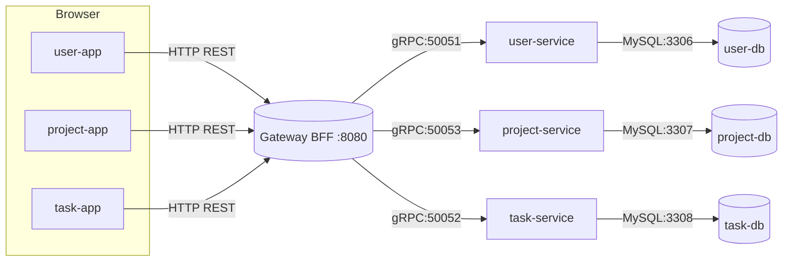
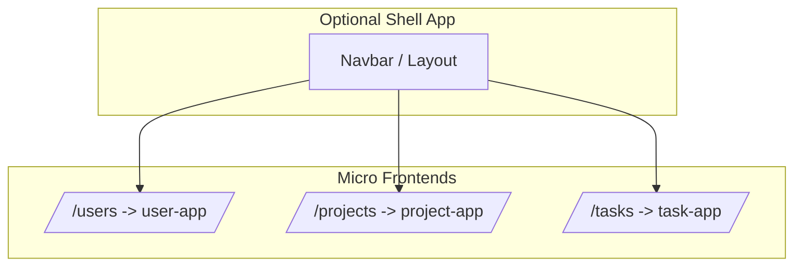
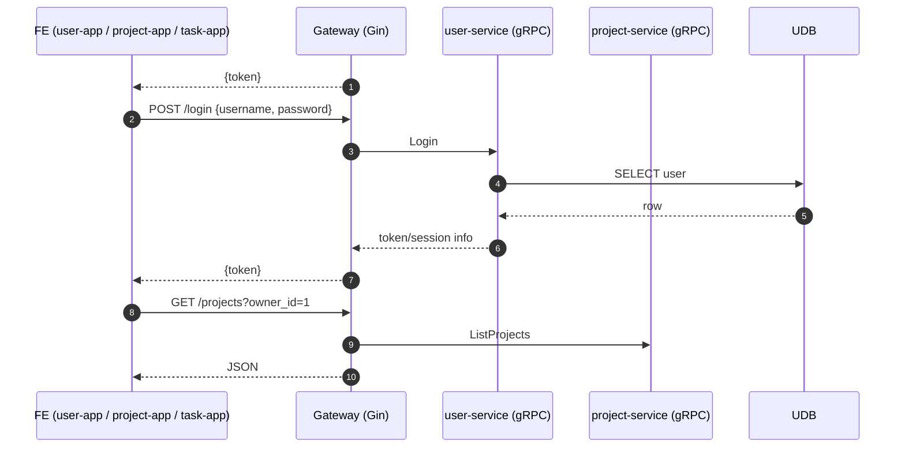
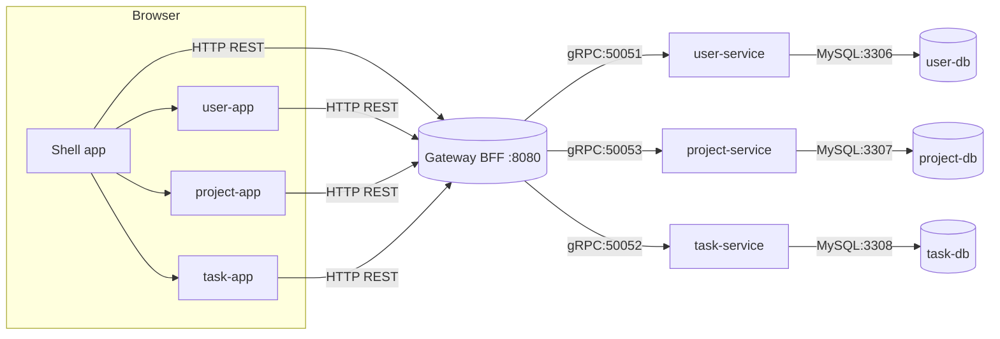
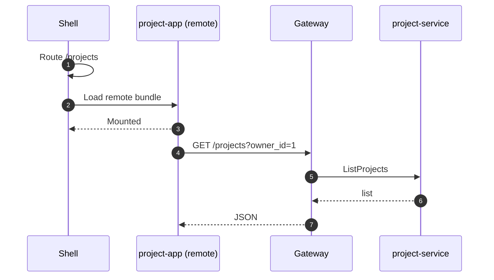
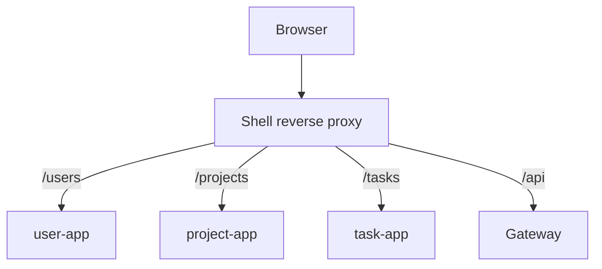
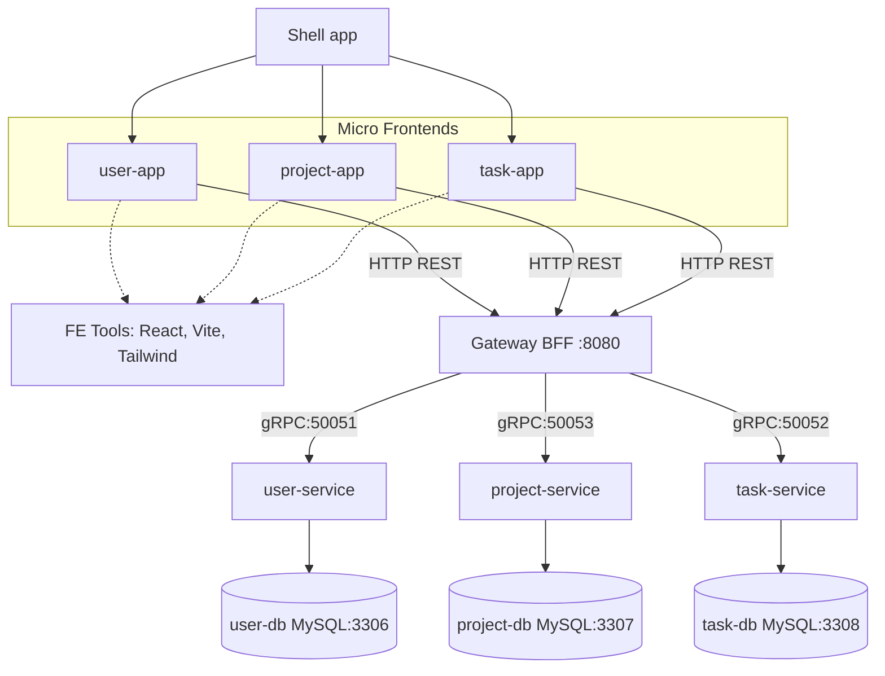
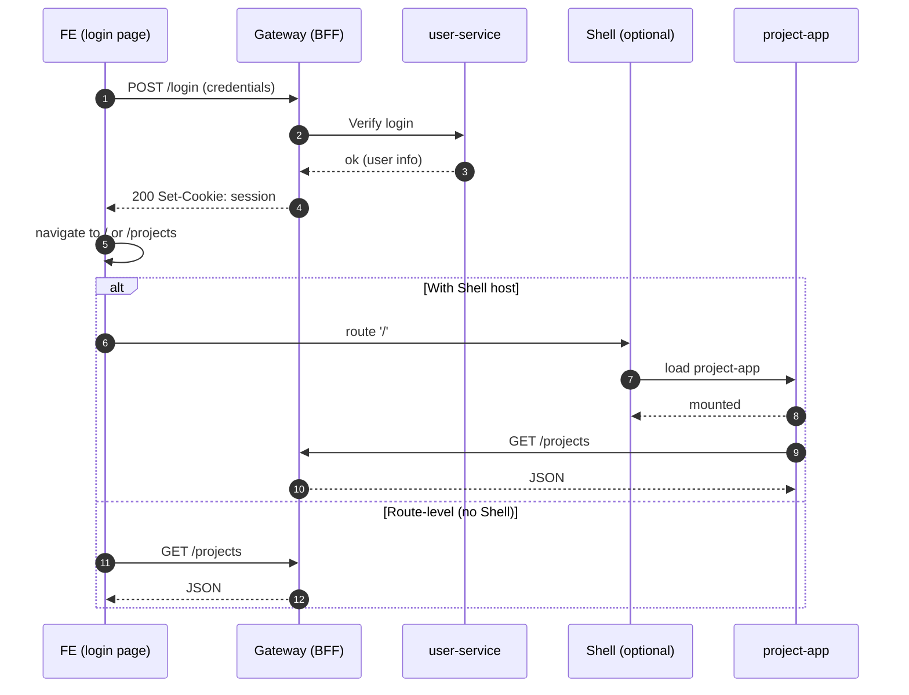

# TaskManager architecture diagrams

- Micro Frontend (MFE): tách UI thành nhiều ứng dụng nhỏ (user‑app, project‑app, task‑app) phát triển và deploy độc lập.
- Gateway/BFF (Gin): một điểm vào duy nhất cho FE, lo auth, CORS, rate‑limit, aggregate dữ liệu; FE chỉ gọi base URL (`VITE_API_BASE`).
- Services (gRPC): user‑service, project‑service, task‑service xử lý nghiệp vụ, giao tiếp qua gRPC.
- Database per service: mỗi service có DB riêng (chuẩn microservices).
- Port dùng: Gateway :8080; gRPC 50051/50052/50053; MySQL 3306/3307/3308.

## 1) High-level system view



Notes:
- FE apps call only the Gateway (single base URL via `VITE_API_BASE`).
- Gateway/BFF aggregates and translates REST to gRPC.
- Each service has its own database (microservice per DB).

What to look for:
- Responsibilities: FE render UI; Gateway chịu auth/CORS/rate-limit/aggregation; services xử lý nghiệp vụ; mỗi service own DB của chính nó.
- Data path: FE → REST → Gateway → gRPC → Service → DB → ngược lại.
- Ports: Gateway :8080, gRPC (50051/50052/50053), MySQL (3306/3307/3308).

Common pitfalls:
- Gọi thẳng service từ FE (bỏ qua Gateway) → vướng CORS, thiếu auth/limit.
- Nhầm cổng/URL env (VITE_API_BASE) → 503 hoặc ECONNREFUSED.

Giải thích (tiếng Việt):
- Sơ đồ này cho thấy tất cả request từ trình duyệt đi vào Gateway. Gateway đóng vai “bộ chuyển đổi” giữa REST và gRPC, đồng thời kiểm soát bảo mật/giới hạn. Mỗi service tự quản DB riêng, giảm phụ thuộc lẫn nhau.

## 2) Frontend composition (route-level + optional shell)



Notes:
- Simple approach: route-level composition. Reverse proxy or shell routes /users, /projects, /tasks to each app.
- Shell is optional. Without shell, each app can render its own header.

What to look for:
- Route biên giới rõ ràng: mỗi micro‑app sở hữu một gốc (/users, /projects, /tasks).
- Shell (nếu có) điều phối điều hướng + layout chung.

Common pitfalls:
- CSS tràn giữa app: nên cô lập (Tailwind utility, CSS Modules, hoặc Shadow DOM nếu dùng Web Components).
- State chia sẻ dày đặc giữa app: ưu tiên truyền qua URL (deep link) hoặc sự kiện nhẹ.

Giải thích (tiếng Việt):
- Ở mức route, mỗi micro‑app “ôm” một đường dẫn gốc riêng. Có thể có Shell (navbar/layout) để điều hướng, hoặc để từng app tự hiển thị header. Cần chú ý cô lập CSS để app này không ảnh hưởng app khác.

## 3) Auth (BFF session) request flow



Tips:
- Prefer BFF session cookies (HttpOnly) for security; avoid storing raw tokens in JS if possible.
- Keep micro-apps thin; offload cross-cutting concerns (auth, rate-limit, CORS) to the Gateway.

What to look for:
- Hai chế độ: Cookie HttpOnly (khuyến nghị, an toàn hơn) hoặc Bearer token (đơn giản, dev nhanh).
- FE luôn gọi Gateway; Gateway gọi user-service để xác thực/đăng nhập.

Common pitfalls:
- Lưu token ở localStorage dễ bị XSS lộ token; nếu phải dùng token, hạn chế scope/thời hạn.
- Quên SameSite/CSRF khi dùng cookie.

Giải thích (tiếng Việt):
- Luồng đăng nhập: FE gửi /login → Gateway gọi user‑service. Nếu dùng session cookie HttpOnly, FE không cần giữ token trong JS (an toàn hơn). Nếu dùng bearer token, FE phải gắn Authorization cho mỗi request.

---

If you want, I can add a simple shell-app with Tailwind navbar and route wiring to mount the three micro-apps, or wire a reverse proxy map in Nomad/NGINX to route /users, /projects, /tasks.

## 4) With Shell App (host) — high‑level



Notes:
- Shell điều phối navigation/layout; micro-app render nội dung theo route.
- Tất cả FE gọi về Gateway; logic ghép dữ liệu đặt ở Gateway và các service gRPC.

What to look for:
- Shell chỉ điều phối UI; không nên nhồi logic nghiệp vụ vào Shell.
- Micro‑apps build/deploy độc lập; Shell chọn phiên bản nào để mount.

Giải thích (tiếng Việt):
- Shell là “vỏ” chứa menu/layout; khi chuyển route, Shell quyết định app nào render. Micro‑app vẫn gọi Gateway như cũ, Shell không xử lý nghiệp vụ.

## 5) Client‑side composition inside Shell (runtime load)



Notes:
- Shell có thể tải micro-app dạng remote (Module Federation/Web Components) khi điều hướng.
- Micro-app gọi Gateway như bình thường.

What to look for:
- Runtime load giúp đổi phiên bản micro‑app không rebuild Shell.
- Cân nhắc share React để tránh “dual React” nếu dùng Module Federation.

Giải thích (tiếng Việt):
- Khi người dùng vào /projects, Shell mới tải “gói” project‑app và mount vào layout. Cách này linh hoạt nâng cấp từng app mà không build lại Shell.

## 6) Reverse proxy map (optional)



Notes:
- Proxy định tuyến route đến đúng micro-app; API đi qua /api về Gateway.

What to look for:
- Tách hẳn UI routes và API route (/api) để clear CORS và cache policy.
- Có thể đặt cache static cho micro‑app, còn /api no‑cache.

Common pitfalls:
- Rewrite sai path (ví dụ thiếu stripPrefix) khiến app không load asset.
- Mixed origins gây CORS; tốt nhất cùng origin (proxy) trong prod.

Giải thích (tiếng Việt):
- Reverse proxy giúp giữ cùng một origin (domain) cho tất cả app/UI và API, tránh lỗi CORS. Cần cấu hình rewrite cẩn thận để asset của app được phục vụ đúng đường dẫn.

---

## Công cụ Frontend sử dụng
- React: thư viện UI component‑based, giúp tách nhỏ giao diện, tái sử dụng và quản lý state rõ ràng.
- Vite: công cụ dev server/build rất nhanh (HMR mượt), cấu hình gọn, phù hợp micro‑apps độc lập.
- Tailwind CSS: bộ utility‑first CSS, giúp style nhất quán, nhanh, hạn chế xung đột CSS giữa các app.

Vì sao phù hợp micro frontend:
- React phù hợp tách app theo route/thành phần; Tailwind giúp cô lập style; Vite giúp mỗi app có vòng đời dev/build riêng, khởi động nhanh và deploy độc lập.

## 7) Tổng quan kiến trúc micro frontend (kèm công cụ)



Giải thích (tiếng Việt):
- Bên FE có ba micro‑app (user, project, task) và có thể thêm Shell để điều hướng/layout.
- Mỗi micro‑app dùng bộ công cụ React + Vite + Tailwind; dev và build độc lập.
- FE chỉ gọi Gateway qua REST; Gateway gọi services qua gRPC; mỗi service gắn với một MySQL riêng.

What to look for:
- FE tools: React (component), Vite (dev/build nhanh), Tailwind (utility CSS).
- BFF: chuẩn hóa auth, CORS, rate‑limit, aggregation; là cửa duy nhất FE gọi.
- Boundaries: ranh giới theo route (/users, /projects, /tasks); mỗi service own DB.

Common pitfalls:
- Ghép app mà quên cô lập CSS → style đè nhau.
- FE gọi thẳng service → CORS/auth lỗi; phải qua Gateway.
- Sai port/URL env (VITE_API_BASE, gRPC, MySQL) → không kết nối được.

---

## 8) Luồng: từ Login → Home (chuyển micro‑app)



Giải thích nhanh:
- FE gửi /login đến Gateway. Gateway gọi user-service để xác thực và trả về session cookie.
- Sau khi thành công, FE điều hướng sang trang Home (ví dụ /projects).
- Nếu có Shell, Shell sẽ nạp project-app (runtime) và project-app tự gọi API. Nếu không có Shell, FE tại route /projects gọi API trực tiếp đến Gateway.

### Chi tiết khi dùng Shell (host)

Step-by-step:
1) Shell render route "/login" và mount login page (có thể là user-app phần login hoặc 1 màn đơn giản trong Shell).
2) Người dùng submit form → gọi POST /login đến Gateway.
3) Gateway xác thực (user-service) → trả 200 và Set-Cookie: session (HttpOnly).
4) Login page thông báo cho Shell (ví dụ dispatch sự kiện window 'auth:login') hoặc Shell tự poll/đọc cookie ⇒ Shell cập nhật trạng thái authenticated.
5) Shell navigate('/') hoặc '/projects'.
6) Shell lazy-load project-app (remote) và mount vào vùng nội dung.
7) project-app khi mounted sẽ gọi GET /projects tới Gateway để lấy dữ liệu ban đầu.

Contract nhỏ:
- Input: credentials (username/password) tại /login.
- Side effects: session cookie do Gateway set; Shell chuyển route; project-app được mount.
- Output (success): người dùng ở trang Home (/ hoặc /projects) và thấy danh sách dự án.
- Output (error): thông báo lỗi đăng nhập, không điều hướng.

Edge cases cần lưu ý:
- Sai mật khẩu hoặc 401 → không điều hướng, hiển thị thông báo.
- Cookie không được set (khác domain, SameSite, HTTPS) → Shell coi như chưa login.
- Tải project-app thất bại (network/CDN) → Shell cần fallback UI và nút retry.
- Hết hạn session giữa chừng → project-app nhận 401; Shell chuyển về /login.

### Ví dụ Shell nạp project-app (giản lược)

Runtime event bus (login page):

```tsx
// user-app/src/pages/Login.tsx (đã rút gọn ở trên)
// ... on successful login:
window.dispatchEvent(new CustomEvent('auth:login'))
```

Shell điều hướng và load remote:

```tsx
// shell-app/src/routes/Root.tsx
import { useEffect, useState } from 'react'
import { useNavigate } from 'react-router-dom'

export default function Root() {
  const navigate = useNavigate()
  const [Mounted, setMounted] = useState<null | (() => JSX.Element)>(null)

  useEffect(() => {
    const onLogin = async () => {
      navigate('/projects')
      // Ví dụ dynamic import (Module Federation/Web Component tuỳ bạn triển khai)
      const mod = await import('projectApp/Root') // alias cấu hình tại build/proxy
      setMounted(() => mod.default) // component gốc của project-app
    }
    window.addEventListener('auth:login', onLogin)
    return () => window.removeEventListener('auth:login', onLogin)
  }, [navigate])

  return (
    <div className="shell">
      <header>Navbar</header>
      <main>{Mounted ? <Mounted /> : <div>Welcome</div>}</main>
    </div>
  )
}
```

Gợi ý triển khai remote:
- Module Federation: expose `project-app` entry (ví dụ `exposes: { './Root': './src/App.tsx' }`) và Shell `remotes: { projectApp: 'project_app@/static/project_app_remoteEntry.js' }`.
- Web Component: project-app build ra custom element `<project-app-root>`; Shell chỉ cần `<project-app-root />` khi vào route.
- Reverse proxy: đảm bảo static của từng app được phục vụ cùng origin để tránh CORS và cookie vấn đề.

Bảo mật:
- Ưu tiên session cookie HttpOnly do Gateway quản lý; project-app không cần cầm token.
- Khi 401 ở bất kỳ API, Shell bắt và điều hướng về /login.

Ví dụ code (React, rút gọn):

Login (user-app):

```tsx
// user-app/src/pages/Login.tsx
import { useState } from 'react'

export default function Login() {
  const [u, setU] = useState('')
  const [p, setP] = useState('')

  async function onSubmit(e: React.FormEvent) {
    e.preventDefault()
    const res = await fetch('/login', {
      method: 'POST',
      headers: { 'Content-Type': 'application/json' },
      body: JSON.stringify({ username: u, password: p })
    })
    if (res.ok) {
      // Option A: thông báo cho Shell
      window.dispatchEvent(new CustomEvent('auth:login'))
      // Option B: route-level, không có Shell
      window.location.href = '/projects'
    }
  }

  return (
    <form onSubmit={onSubmit} className="space-y-2">
      <input value={u} onChange={e => setU(e.target.value)} placeholder="username" className="border p-2" />
      <input type="password" value={p} onChange={e => setP(e.target.value)} placeholder="password" className="border p-2" />
      <button className="bg-blue-600 text-white px-3 py-2 rounded">Đăng nhập</button>
    </form>
  )
}
```

Shell lắng nghe sự kiện và điều hướng (nếu dùng Shell):

```tsx
// shell-app/src/App.tsx
import { useEffect } from 'react'
import { useNavigate } from 'react-router-dom'

export default function App() {
  const navigate = useNavigate()
  useEffect(() => {
    const onLogin = () => navigate('/projects')
    window.addEventListener('auth:login', onLogin)
    return () => window.removeEventListener('auth:login', onLogin)
  }, [navigate])
  return null
}
```

Ghi chú:
- Dùng session cookie HttpOnly từ Gateway nên không cần chia sẻ token giữa app; chỉ cần điều hướng.
- Nếu không có Shell, sau đăng nhập chỉ cần redirect sang /projects (đã reverse proxy tới project-app).
