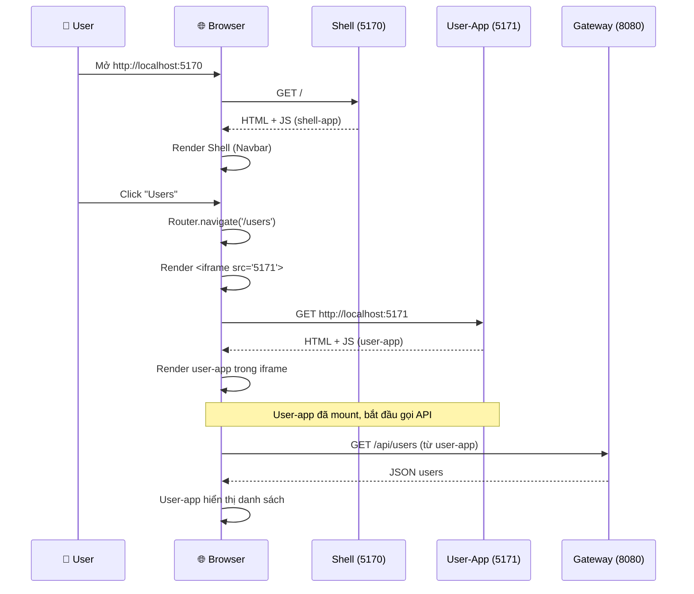
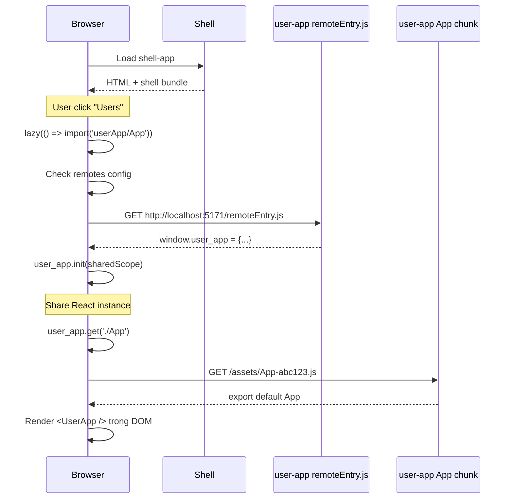

# So sánh chi tiết: Iframe vs Module Federation trong Micro Frontend

## Mục lục
1. [Thuật ngữ chuyên ngành](#thuật-ngữ)
2. [Iframe-based MFE (đang dùng)](#iframe-approach)
3. [Module Federation (đã thử trước đó)](#module-federation)
4. [So sánh chi tiết](#comparison)
5. [Khi nào dùng approach nào](#when-to-use)

---

## 1. Thuật ngữ chuyên ngành {#thuật-ngữ}

### Micro Frontend (MFE)
**Định nghĩa**: Kiến trúc chia nhỏ ứng dụng frontend thành các phần độc lập, tương tự microservices ở backend.

**Ví dụ trong code**:
```
TaskManager (monolith cũ)
→ Tách thành:
  ├── user-app (quản lý users)
  ├── project-app (quản lý projects)
  └── task-app (quản lý tasks)
```

### Shell App / Host App
**Định nghĩa**: Ứng dụng "vỏ bọc" chứa navbar, layout chung và điều phối (orchestrate) các micro-apps.

**Trong code**: `frontend/shell-app/` - chạy port 5170, chứa Router và load các app con.

### Remote App / Child App
**Định nghĩa**: Các micro-app độc lập được Shell load vào runtime.

**Trong code**: `user-app` (5171), `project-app` (5172), `task-app` (5173).

### Runtime Integration
**Định nghĩa**: Cách các micro-apps được kết hợp lại **khi đang chạy** (không phải build time).

**Hai cách chính**:
- **Iframe**: Embed HTML page trong page khác
- **Module Federation**: Share JavaScript modules giữa apps

### Build-time vs Runtime
**Build-time**: Khi chạy `npm run build` - code được compile, bundle.
**Runtime**: Khi user mở browser - code được execute, tải về, chạy.

**Ví dụ**:
- Build-time: Tạo file `dist/index.html`, `dist/main.js`
- Runtime: Browser tải `main.js` và chạy React code

### Bundle / Chunk
**Bundle**: File JavaScript cuối cùng sau khi build (gộp nhiều file lại).
**Chunk**: Phần nhỏ của bundle, có thể lazy-load (tải sau).

**Ví dụ**: `npm run build` tạo `dist/assets/index-abc123.js` (bundle) và `dist/assets/UserPage-def456.js` (chunk).

### Shared Dependencies
**Định nghĩa**: Các thư viện dùng chung (React, Axios) được load 1 lần thay vì mỗi app load riêng.

**Vấn đề**: Nếu user-app và project-app đều load React riêng → tốn bandwidth, chậm.
**Giải pháp**: Module Federation share React → chỉ load 1 lần.

### Cross-Origin / CORS
**Cross-Origin**: Khi JavaScript ở `domain-A.com` gọi API ở `domain-B.com`.
**CORS** (Cross-Origin Resource Sharing): Cơ chế bảo mật của browser, yêu cầu server cho phép.

**Ví dụ**: Shell (localhost:5170) load iframe (localhost:5171) → **không bị CORS** (cùng localhost).

### postMessage API
**Định nghĩa**: JavaScript API cho phép 2 window/iframe giao tiếp an toàn.

**Ví dụ**:
```js
// Shell gửi
iframe.contentWindow.postMessage({ token: 'abc' }, 'http://localhost:5171')

// User-app nhận
window.addEventListener('message', (event) => {
  console.log(event.data.token) // 'abc'
})
```

### X-Frame-Options
**Định nghĩa**: HTTP header ngăn website bị embed vào iframe (chống clickjacking).

**Ví dụ**: Nếu Gateway trả header `X-Frame-Options: DENY` → iframe sẽ bị block.

---

## 2. Iframe-based MFE (Đang dùng) {#iframe-approach}

### Cách hoạt động

#### Bước 1: Shell render routes
**File**: `frontend/shell-app/src/App.jsx`

```jsx
<Routes>
  <Route path="/users" element={
    <MicroAppFrame src="http://localhost:5171" title="User App" />
  } />
  <Route path="/projects" element={
    <MicroAppFrame src="http://localhost:5172" title="Project App" />
  } />
  <Route path="/tasks" element={
    <MicroAppFrame src="http://localhost:5173" title="Task App" />
  } />
</Routes>
```

**Giải thích**:
- Khi URL = `/users` → Router match route `/users`
- Render component `<MicroAppFrame>`
- Component này chứa `<iframe src="http://localhost:5171">`

#### Bước 2: Browser load iframe
```html
<!-- Shell HTML -->
<body>
  <nav>Navbar của Shell</nav>
  <main>
    <iframe src="http://localhost:5171" style="min-height: calc(100vh - 120px)">
      <!-- Nội dung user-app được load vào đây -->
    </iframe>
  </main>
</body>
```

**Luồng tải**:
1. Browser thấy `<iframe src="http://localhost:5171">`
2. Gửi HTTP GET request đến `http://localhost:5171`
3. Vite dev server của user-app trả về `index.html`
4. Browser render user-app **bên trong iframe** (sandbox riêng)

#### Bước 3: User-app chạy độc lập
**File**: `frontend/user-app/src/main.jsx`

```jsx
import React from 'react'
import { createRoot } from 'react-dom/client'
import App from './App'

createRoot(document.getElementById('root')).render(<App />)
```

**Điểm quan trọng**:
- User-app **không biết** nó đang chạy trong iframe hay standalone
- Nó vẫn tự render vào `#root` như bình thường
- Có **window object riêng**, **DOM riêng**, **React context riêng**

### Luồng hoạt động chi tiết (Sequence)



### Ưu điểm

#### 1. **Isolation hoàn toàn** (Cô lập tuyệt đối)
**Giải thích**: Mỗi iframe có:
- **DOM tree riêng**: Không xung đột ID, class names
- **JavaScript scope riêng**: `window`, `document` khác nhau
- **CSS scope riêng**: Styles của user-app không ảnh hưởng Shell

**Ví dụ thực tế**:
```css
/* Shell CSS */
.container { max-width: 1024px; }

/* User-app CSS (trong iframe) */
.container { max-width: 800px; }

/* Không xung đột! Vì nằm 2 document khác nhau */
```

**Trong Module Federation**: CSS có thể conflict → cần Shadow DOM hoặc CSS Modules.

#### 2. **Technology agnostic** (Không phụ thuộc công nghệ)
**Giải thích**: Mỗi app có thể dùng framework khác nhau.

**Ví dụ**:
```
Shell: React 18 + React Router
User-app: Vue 3 + Vue Router
Project-app: Angular 15 + Angular Router
Task-app: Svelte + SvelteKit

→ Vẫn hoạt động bình thường!
```

**Trong Module Federation**: Tất cả phải cùng React version → khó upgrade.

#### 3. **Đơn giản setup**
**So sánh**:

**Iframe** (đang dùng):
```js
// vite.config.js - chỉ cần React plugin
export default defineConfig({
  plugins: [react()],
  server: { port: 5171 }
})
```

**Module Federation** (đã thử):
```js
// vite.config.js - phức tạp hơn
export default defineConfig({
  plugins: [
    react(),
    federation({
      name: 'user_app',
      filename: 'remoteEntry.js',
      exposes: { './App': './src/App.jsx' },
      shared: {
        react: { singleton: true, requiredVersion: '^18.2.0' },
        'react-dom': { singleton: true, requiredVersion: '^18.2.0' }
      }
    })
  ],
  build: {
    modulePreload: false,
    target: 'esnext',
    minify: false,
    cssCodeSplit: false
  }
})
```

**Kết quả**: 
- Iframe: 10 dòng config
- Module Federation: 30+ dòng config + phải debug remoteEntry.js

#### 4. **Deployment độc lập**
**Production setup**:

```nginx
# Shell
https://taskmanager.com → /var/www/shell-app/dist

# Micro-apps
https://users.taskmanager.com → /var/www/user-app/dist
https://projects.taskmanager.com → /var/www/project-app/dist
https://tasks.taskmanager.com → /var/www/task-app/dist
```

**Deploy flow**:
1. Fix bug trong user-app
2. Build: `cd user-app; npm run build`
3. Deploy chỉ user-app: `rsync dist/ server:/var/www/user-app/`
4. Shell và apps khác **không cần redeploy**

**Trong Module Federation**: Deploy user-app có thể break Shell nếu API thay đổi.

### Nhược điểm

#### 1. **Performance overhead** (Tốn tài nguyên)
**Vấn đề**: Mỗi iframe load:
- React bundle riêng (~140KB gzipped)
- React-DOM bundle riêng (~130KB)
- Axios, Tailwind, v.v. đều load riêng

**Ví dụ**:
```
User mở /users → load:
- Shell: React (140KB) + Router (10KB) + Shell code (20KB)
- User-app iframe: React (140KB) + Router (10KB) + User code (30KB)

Total: ~350KB

Với Module Federation (shared):
- Shell + User-app: React (140KB - shared) + Routers (20KB) + Code (50KB)
Total: ~210KB
```

**Khi nào quan trọng**: 
- Mobile/3G network → Iframe chậm hơn
- Desktop/WiFi → Không đáng kể (HTTP/2 cache tốt)

#### 2. **Communication phức tạp**
**Vấn đề**: Shell và iframe giao tiếp qua `postMessage` - cồng kềnh hơn function call.

**Ví dụ**:

**Iframe approach**:
```jsx
// Shell gửi token cho user-app
useEffect(() => {
  const iframe = document.querySelector('iframe')
  iframe?.contentWindow?.postMessage(
    { type: 'TOKEN', value: 'abc123' },
    'http://localhost:5171'
  )
}, [])

// User-app nhận
useEffect(() => {
  window.addEventListener('message', (event) => {
    if (event.origin !== 'http://localhost:5170') return
    if (event.data.type === 'TOKEN') {
      setToken(event.data.value)
    }
  })
}, [])
```

**Module Federation approach**:
```jsx
// Shell truyền props trực tiếp
const UserApp = lazy(() => import('userApp/App'))

<UserApp token="abc123" />

// User-app nhận
function App({ token }) {
  // Dùng luôn
}
```

**Kết luận**: Module Federation giao tiếp đơn giản hơn (như component bình thường).

#### 3. **SEO khó khăn**
**Vấn đề**: Google crawler không index nội dung iframe tốt.

**Ví dụ**:
```html
<!-- Shell -->
<h1>TaskManager</h1>
<iframe src="/users"></iframe>

<!-- Google chỉ thấy "TaskManager", không thấy user list bên trong iframe -->
```

**Giải pháp**: 
- SSR (Server-Side Rendering) cho từng app
- Hoặc dùng prerender.io
- Hoặc chấp nhận (nếu là internal tool, không cần SEO)

---

## 3. Module Federation (Đã thử trước đó) {#module-federation}

### Cách hoạt động

#### Khái niệm core

**Module Federation** = Webpack/Vite plugin cho phép:
- App A **expose** (xuất) modules
- App B **import** modules từ A **lúc runtime** (không phải build time)

**Ví dụ tương tự**: 
- NPM package: import code lúc build time
- Module Federation: import code lúc runtime (từ remote server)

#### Bước 1: Remote app expose module

**File**: `frontend/user-app/vite.config.js` (config cũ, đã xóa)

```js
federation({
  name: 'user_app',
  filename: 'remoteEntry.js',
  exposes: {
    './App': './src/App.jsx' // Expose component App
  },
  shared: ['react', 'react-dom'] // Share dependencies
})
```

**Build output**:
```
user-app/dist/
├── remoteEntry.js        ← File "manifest" đặc biệt
├── assets/
│   ├── App-abc123.js     ← Chunk chứa App component
│   ├── react-def456.js   ← Shared React
│   └── index-ghi789.js   ← Entry point
```

**remoteEntry.js** chứa:
```js
// Simplified
window.user_app = {
  get(moduleName) {
    if (moduleName === './App') {
      return import('./assets/App-abc123.js')
    }
  },
  init(sharedScope) {
    // Setup shared dependencies
  }
}
```

#### Bước 2: Shell import remote module

**File**: `frontend/shell-app/vite.config.js` (config cũ)

```js
federation({
  name: 'shell',
  remotes: {
    userApp: 'http://localhost:5171/remoteEntry.js'
  },
  shared: ['react', 'react-dom']
})
```

**File**: `frontend/shell-app/src/App.jsx` (code cũ)

```jsx
import { lazy } from 'react'

// Dynamic import từ remote
const UserApp = lazy(() => import('userApp/App'))

function App() {
  return (
    <Routes>
      <Route path="/users" element={<UserApp />} />
    </Routes>
  )
}
```

#### Bước 3: Runtime loading

**Luồng chi tiết**:



**Giải thích từng bước**:

1. **Shell load**: Browser tải shell-app như bình thường
2. **User click**: Router trigger lazy import
3. **Load remoteEntry**: Browser tải file manifest từ user-app
4. **Init shared scope**: Shell và user-app "thỏa thuận" dùng chung React instance
5. **Get module**: Browser tải chunk chứa App component
6. **Render**: Render `<UserApp />` như một React component thông thường

### Ưu điểm

#### 1. **Shared dependencies** (Tiết kiệm bandwidth)

**Ví dụ**:

**Không có MF**:
```
Shell load: React (140KB) + Router (10KB) + Shell (20KB) = 170KB
User-app load: React (140KB) + Router (10KB) + User (30KB) = 180KB
Total: 350KB
```

**Có MF**:
```
Shell load: React (140KB - shared) + Router (10KB) + Shell (20KB) = 170KB
User-app load: Router (10KB) + User (30KB) = 40KB
Total: 210KB (tiết kiệm 40%)
```

**Cách hoạt động**:
```js
// Shell và user-app cùng config
shared: {
  react: { singleton: true }
}

// Runtime
if (shell đã load React 18.2.0) {
  user-app dùng luôn instance đó
} else {
  user-app load React riêng
}
```

#### 2. **Native React integration**

**So sánh**:

**Iframe**:
```jsx
// Shell
<iframe src="http://localhost:5171" />

// Communication
postMessage({ type: 'TOKEN', value: 'abc' })
```

**Module Federation**:
```jsx
// Shell
const UserApp = lazy(() => import('userApp/App'))

<UserApp token="abc" onLogout={() => console.log('logout')} />

// User-app
function App({ token, onLogout }) {
  // Nhận props như component thông thường
}
```

**Ưu điểm**: 
- Props typing (TypeScript)
- Context sharing
- Event callbacks đơn giản

#### 3. **Better performance** (Trong một số trường hợp)

**Khi nào tốt hơn**:
- User xem nhiều micro-apps trong 1 session
- Shared deps lớn (React, MUI, Chart.js)
- Network chậm

**Benchmark** (giả định):
```
First load (Shell + user-app):
- Iframe: 350KB
- MF: 210KB ✅ Nhanh hơn

Navigate to project-app:
- Iframe: 180KB (load lại React)
- MF: 40KB ✅ Nhanh hơn nhiều (React đã có)
```

### Nhược điểm (Lý do bỏ)

#### 1. **Complexity cao**

**Config phức tạp**:
```js
// 40+ dòng config cho mỗi app
federation({
  name: 'user_app',
  filename: 'remoteEntry.js',
  exposes: { './App': './src/App.jsx' },
  shared: {
    react: {
      singleton: true,
      strictVersion: true,
      requiredVersion: '^18.2.0',
      eager: false
    },
    'react-dom': { ... },
    'react-router-dom': { ... }
  }
})
```

**Debug khó**:
```
Lỗi: "Shared module is not available for eager consumption"
→ Nguyên nhân: eager: true conflict với lazy import
→ Giải pháp: Đọc docs 30 phút, thử 10 config khác nhau
```

#### 2. **remoteEntry.js không tồn tại** (Vấn đề gặp phải)

**Lỗi**:
```
GET http://localhost:5171/remoteEntry.js 404 (Not Found)
```

**Nguyên nhân**:
- Plugin `@originjs/vite-plugin-federation` version "latest" không tương thích Vite 5
- Hoặc cần config thêm `build.target`, `build.modulePreload`
- Hoặc dev server không serve file đúng path

**Thời gian debug**: 2-3 giờ, vẫn không fix được → Quyết định chuyển sang iframe.

#### 3. **Version conflict**

**Vấn đề**:
```
Shell: React 18.2.0
User-app: React 18.3.0

→ MF quyết định dùng version nào?
→ Nếu incompatible → runtime error
```

**Ví dụ lỗi**:
```
TypeError: Cannot read property 'useState' of undefined

Nguyên nhân: user-app dùng React 18.3 API
Shell share React 18.2 (không có API đó)
```

**Trong iframe**: Mỗi app dùng version riêng → không conflict.

#### 4. **Build coupling**

**Vấn đề**: Nếu user-app thay đổi exposed API:

**Before**:
```js
// user-app exposes
export default function App() { ... }

// Shell imports
const UserApp = lazy(() => import('userApp/App'))
<UserApp />
```

**After** (user-app refactor):
```js
// user-app exposes
export { UserApp as default }

// Shell vẫn import như cũ
→ Có thể bị lỗi nếu export signature thay đổi
```

**Trong iframe**: Chỉ cần serve HTML, không phụ thuộc export format.

---

## 4. So sánh chi tiết {#comparison}

### Bảng so sánh toàn diện

| Tiêu chí | Iframe ✅ | Module Federation ⚠️ |
|----------|----------|----------------------|
| **Setup complexity** | Rất đơn giản (10 dòng config) | Phức tạp (40+ dòng, nhiều options) |
| **Learning curve** | Thấp (HTML/JS cơ bản) | Cao (phải hiểu Webpack/Vite internals) |
| **Debug difficulty** | Dễ (F12 → switch frame) | Khó (shared scope, version conflicts) |
| **CSS isolation** | ✅ Tự động (mỗi iframe = 1 document) | ⚠️ Cần CSS Modules/Shadow DOM |
| **JS isolation** | ✅ Tự động (mỗi iframe = 1 window) | ⚠️ Shared global scope |
| **Tech stack flexibility** | ✅ Bất kỳ (React, Vue, Angular...) | ⚠️ Phải cùng framework/version |
| **Communication** | ⚠️ postMessage (verbose) | ✅ Props/callbacks (native) |
| **Performance (first load)** | ⚠️ Load deps nhiều lần | ✅ Shared deps |
| **Performance (navigation)** | ⚠️ Reload iframe mỗi lần | ✅ SPA smooth |
| **Bundle size** | ⚠️ Lớn hơn (duplicate deps) | ✅ Nhỏ hơn (shared) |
| **Deployment** | ✅ Hoàn toàn độc lập | ⚠️ Cần sync versions |
| **Rollback** | ✅ Chỉ rollback 1 app | ⚠️ Có thể break Shell |
| **SEO** | ⚠️ Google không index iframe tốt | ✅ Crawl được (nếu SSR) |
| **Security** | ⚠️ postMessage có thể bị sniff | ✅ Same-origin, an toàn hơn |
| **Browser compatibility** | ✅ IE11+ | ⚠️ Modern browsers only |

### Use case phù hợp

#### Dùng Iframe khi:
1. **Team autonomy cao**: Mỗi team dùng tech stack riêng
2. **Internal tools**: Không cần SEO, không quan trọng performance
3. **Legacy integration**: Cần embed app cũ (jQuery, AngularJS) vào app mới
4. **Strict isolation**: Bảo mật cao, không muốn shared memory
5. **Prototype nhanh**: MVP, POC, không có thời gian setup phức tạp

**Ví dụ thực tế**:
- Admin dashboard (Spotify, Zalando)
- Internal CRM/ERP
- Microservices console (AWS, GCP)

#### Dùng Module Federation khi:
1. **Performance critical**: Mobile app, low bandwidth users
2. **Tight integration**: Cần share context (Auth, Theme) giữa apps
3. **Same tech stack**: Tất cả đều React, có thể enforce version
4. **SEO quan trọng**: E-commerce, blog, public site
5. **Budget cho DevOps**: Có thời gian setup CI/CD phức tạp

**Ví dụ thực tế**:
- E-commerce (Zalando fashion store)
- SaaS products (ByteDance, TikTok)
- Media sites (cần shared video player)

---

## 5. Khi nào dùng approach nào {#when-to-use}

### Decision Tree

```
Start
  ↓
[ Có thể enforce cùng React version không? ]
  ├─ Không → Iframe
  └─ Có
      ↓
    [ SEO quan trọng không? ]
      ├─ Có → Module Federation
      └─ Không
          ↓
        [ Bundle size có vấn đề không? ]
          ├─ Có (mobile, 3G) → Module Federation
          └─ Không
              ↓
            [ Team size? ]
              ├─ Nhỏ (< 5 devs) → Iframe (đơn giản)
              └─ Lớn (10+ devs) → Module Federation (tối ưu)
```

### Khuyến nghị cho TaskManager

**Hiện tại**: Iframe ✅

**Lý do**:
1. ✅ Internal tool (không cần SEO)
2. ✅ Desktop users (WiFi tốt, bundle size OK)
3. ✅ Đang học/prototype (setup đơn giản quan trọng)
4. ✅ Có thể scale sau (chuyển sang MF nếu cần)

**Khi nào nên chuyển sang Module Federation**:
- Khi có > 50 users đồng thời, network chậm
- Khi cần share Auth context phức tạp
- Khi đã master React, có DevOps engineer riêng
- Khi budget cho infra tăng

---

## 6. Kết luận

### Iframe (Lựa chọn hiện tại)

**Strengths** (Điểm mạnh):
- 🚀 **Simple**: 10 phút setup, không cần học docs
- 🔒 **Isolated**: CSS/JS không conflict, debug dễ
- 🌈 **Flexible**: Mỗi app dùng tech riêng
- 📦 **Independent**: Deploy riêng, rollback dễ

**Weaknesses** (Điểm yếu):
- 🐌 **Slower**: Load duplicate deps (React, libs)
- 📡 **Communication**: postMessage cồng kềnh
- 🔍 **SEO**: Google không index tốt

**Best for**: Internal tools, admin panels, dashboards.

### Module Federation

**Strengths**:
- ⚡ **Fast**: Shared deps, smooth navigation
- 🔗 **Integrated**: Props/context như React bình thường
- 📦 **Optimized**: Bundle size nhỏ hơn 30-40%

**Weaknesses**:
- 🤯 **Complex**: Config 40+ dòng, học docs 2-3 ngày
- 🐛 **Debug khó**: Version conflicts, remoteEntry 404
- 🔄 **Coupling**: Deploy phải sync versions

**Best for**: Public sites, SaaS products, performance-critical apps.

---

## Tài liệu tham khảo

- [Micro Frontends Pattern](https://martinfowler.com/articles/micro-frontends.html) - Martin Fowler
- [Module Federation Official Docs](https://module-federation.io/)
- [Iframe Security Best Practices](https://developer.mozilla.org/en-US/docs/Web/Security/Securing_your_site/iframe)
- [Spotify Micro Frontends](https://engineering.atspotify.com/2022/05/micro-frontends-spotify/) - Case study
